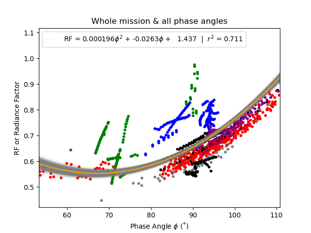
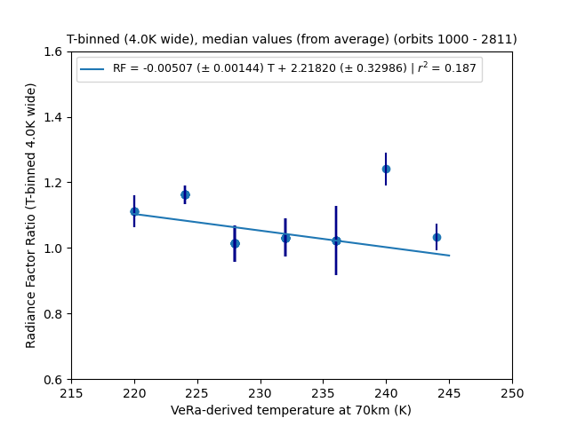
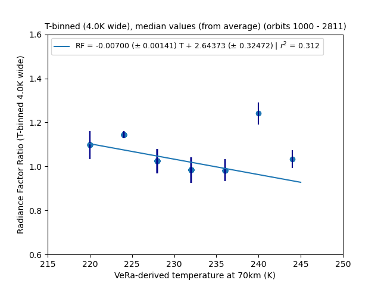
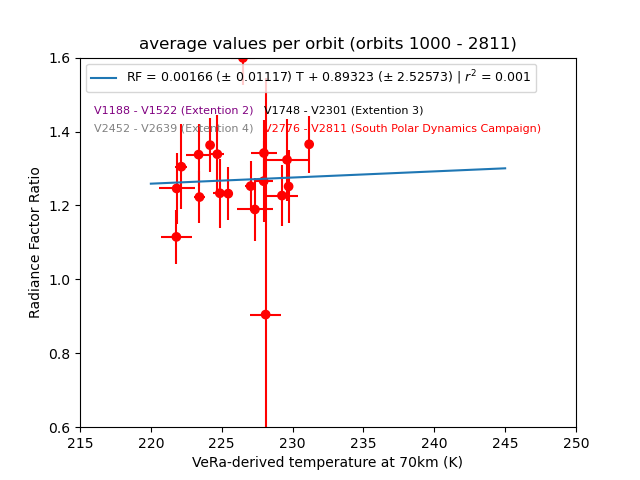
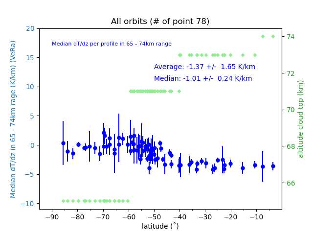
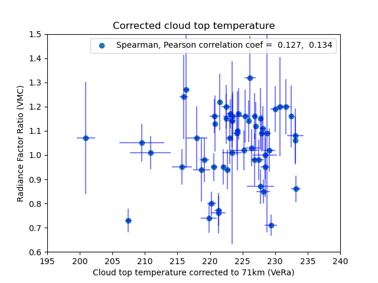

Workbook 
========

Go to :ref:`last point of work <lastPointOfWork>`.

.. _abbrevations:

.. admonition:: abbreviations

    | **IDL** - Interactive Data Language
    | **LST** - Local Solar Time
    | **SPDC** - South Polar Dynamics Campaign
    | **VeRa** - VEnus RAdio science
    | **VEX** - Venus Express
    | **VMC** - Venus Monitoring Camera

.. admonition:: VEX Orbit IDs

    The information about the orbit IDs per mission section comes from the file 
    :file:`SOMEWHEREONYOURCOMPUTER/Data/VEX/VEX-SCIOPS-LI-053_1_1_VEX_Orbit_Date_DOY_Listing_2014Sep15.numbers`,
    see also the link to `Venus Express at the ESA PSA <https://www.cosmos.esa.int/web/psa/venus-express>`_.

    .. csv-table:: **VEX Orbit IDs**
       :header: "mission section", "orbit ID range", date range
    
        Nominal mission,  0001 - 0547, 20-04-2006 - 20-10-2007  
        Extension 1, 0548 - 1135, 21-10-2007 - 30-05-2009
        Extension 2, 1136 - 1583, 31-05-2009 - 21-08-2010
        Extension 3, 1584 - 2451, 22-08-2010 - 05-01-2013
        Extension 4, 2452 - 3575, 06-01-2013 - 31-12-2015
        SPDC, 2775 - 2811, 25-11-2013 - 31-12-2013
        

.. _unresolvedquestionnottoforget:

.. admonition:: unresolved questions not to forget

    - :ref:`Why during the some orbits, in the same orbit different calibration factors where used? <unresolvedquestion1>`

.. _analysisconfigurationfile:

.. admonition:: analysisConfiguration.py file

    This file contains configuration settings needed for the scripts in this project to run.
    It *should* be easy to migrate this entire project to another computer, just by substituting the paths and names of these directories in this file.

    .. code-block:: Python
    
        VeRaDataDirectory = '/Users/maarten/Science/Venus/Data/VEX/VeRa'
        VMCDataDictectory = '/Users/maarten/Science/Venus/Data/VEX/VMC'
        AkatsukiDataDirectory = '/Users/maarten/Science/Venus/Data/Akatsuki'
        SPICAVUCDataDirectory = '/Users/maarten/Science/Venus/Data/EmmanuelMarcq2020'

        VeRaWorkBookDirectory = '/Users/maarten/Science/Venus/VenusResearchWorkBook/Temperature-UVBrightness-Project/VeRa'
        VMCWorkBookDirectory = '/Users/maarten/Science/Venus/VenusResearchWorkBook/Temperature-UVBrightness-Project/VMC'
        
        radiusOfVenus = 6052 #km
        
        
        
    The content of this file is loaded at the top of a script using:
 
    .. code-block:: Python
    
        # Add the path where the  analysisConfiguration.py  script file lives relative to where the script file lives and is run from.
        sys.path.append ( os.path.abspath ('../../../') ) 
        
        # Import the content of the  analysisConfiguration.py  file.
        from analysisConfiguration import *

        
    

.. _temperaturevsuvbrightness:

Temperature vs UV-brightness
-----------------------------

The goal of this project is to investigate whether there is any relation between the atmospheric temperature as measured by means of radio occultation experiments and the UV-brightness as measured from images in the UV.

I started this project with Colin Wilson at Oxford in 2015. At the time, I wrote all scripts using Interactive Date Language (IDL).
At this point (2024) I redo the entire analysis, rewriting all code using Python, documenting the process and the code as thoroughly as possible.

We use Venus Express VeRa and VMC data.

.. _VEXVeRaData:

VEX-VeRa data 
^^^^^^^^^^^^^

Files are found in :file:`VeRa`.

.. _VeRaStep01:

^^^^^^^^^^^^^^^^^^^^^^^^^^^^^^^^^^^^^^^^^^^^^^^^^
Step 01 - Extract VeRa-profiles information
^^^^^^^^^^^^^^^^^^^^^^^^^^^^^^^^^^^^^^^^^^^^^^^^^

.. admonition:: directory, scripts & files

    | top directory: :file:`VeRa/Step01`
    | scripts:
    | :file:`./scripts/CreateTable_VeRa_LocalSolarTime.py`
    | :file:`./scripts/CreateFigure_VeRaProfiles_Lon-Lat_LST-Lat.py`
    | files:
    | :file:`VeRa_LocalSolarTime_OneBarLevel_PerOrbit_SPoleProfiles.dat`
    | :file:`VeRa_LocalSolarTime_OneBarLevel_PerOrbit_SelectedProfiles.dat`

Using the :file:`VeRa_LocalSolarTime_CreateTable.py` script, I create two tables that list the **orbit ID, Day Of Year, time of observation, Local Solar Time, latitude, longitude** and **solar zenith angle** at the one bar level for each of the VeRa soundings used in this project. 

The table :file:`VeRa_LocalSolarTime_OneBarLevel_PerOrbit_SPoleProfiles.dat` contains this information for all the selected profiles from the **SPDC** (orbits 2775 - 2811).
The table :file:`VeRa_LocalSolarTime_OneBarLevel_PerOrbit_SelectedProfiles.dat` contains this information for all the selected profiles from the mission before the **SPDC**. (first included orbit 0260, last included orbit 2638).

With the :file:`VeRaProfiles_Lon-Lat_LST-Lat_Figure.py` I create two plots, showing the distribution of the VeRa sounding locations on the Venus disk and as a function of  *LST*:

.. image:: ../Temperature-UVBrightness-Project/VeRa/Step01/plots/VeRaProfiles_Lon-Lat_Figure.png
    :scale: 60%

.. _VeRaStep02:

^^^^^^^^^^^^^^^^^^^^^^^^^^^^^^^^^^^
Step 02 - Filter VeRa profiles
^^^^^^^^^^^^^^^^^^^^^^^^^^^^^^^^^^^

.. admonition:: directory, scripts & files

    | top directory: :file:`VeRa/Step02`
    | scripts:
    | :file:`./scripts/CreateFigure_VeRaAverageProfile_Tz_dTdz.py`
    | :file:`./scripts/CreateNumpyArray_VeRaAverageProfiles.py`
    | files:
    | :file:`VeRaSelectedProfiles.profiles`
    | :file:`VeRaSouthPolarDynamicsCampaignProfiles.profiles`

We believe that a vertical resolution of 1km for the temperature profiles is sufficient for our purposes. 
Depending of the altitude of sounding, the VeRa profiles have a (much) higher vertical resolution.
I create vertically **averaged** profiles, where I average the temperatures values in vertical bins of one kilometer wide.
I take the standard deviation in each bin as the uncertainty of the average temperature for that bin.
If there is only one value in the bin, then the uncertainty is not calculated (set to NaN). This occurs higher in the atmosphere, above 80km altitude, a region that is not important for this study.

The `VeRaTools.getFilteredVeRaProfile <https://venustools.readthedocs.io/en/latest/veratools.html#VeRaTools.VeRaTools.getFilteredVeRaProfile>`_ method of the `VeraTools pseudo class <https://venustools.readthedocs.io/en/latest/veratools.html#>`_ is designed to create a filtered (vertically averaged) profile from an original VeRa profile.
I use the default settings to calculate profiles between 46km and 101km (56 levels) at a 1km vertical resolution.

.. note::

    Radius of Venus = 6051.8km, we adopt 6052km, hence 6098km ~ 46km altitude.

As an example plots of T(z), dT/dZ (z) and the static stability are shown below with the results for the last VeRa profile from the South Polar Dynamics Campaign (:file:`./scripts/VeRaAverageProfile_Tz_dTdz_Figure.py`, also see :ref:`Step02bis <VeRaStep02bis>` for details on the :code:`.profiles` files):

.. figure:: ../Temperature-UVBrightness-Project/VeRa/Step02/plots/VeRaProfiles_Orb2811_T-z_Figure.png
    :scale: 60%

    (left) Averaged temperature profile between 50 and 100km altitude (blue) and original VeRa profile (orange); (middle) uncertainty (standard deviation) in the temperature as explained in the text above. The gaps are due to missing point, when the uncertainty is set to NaN, because there is only one temperature value in a vertical bin; (right) number of original VeRa temperatures for each vertical bin, in red are indicated levels with only one temperature value.

.. figure:: ../Temperature-UVBrightness-Project/VeRa/Step02/plots/VeRaProfiles_Orb2811_dTdz-z_Figure.png
    :scale: 60%

    (left) Averaged temperature profile dT/dz between 50 and 100km altitude (blue); (middle) parametrised adiabatic lapse rate from Figure 18 in :ref:`Seiff et al. (1980) <Seiff1980>`; (right) static stability = lapse rate + adiabatic lapse rate.

.. _VeRaStep02bis:

^^^^^^^^^^^^^^^^^^^^^^^^^^^^^^^^^^^^^^^^^^^^^^
Step 02bis - the .profiles files
^^^^^^^^^^^^^^^^^^^^^^^^^^^^^^^^^^^^^^^^^^^^^^

In order to make it easier to access all the filtered profiles at once, without the need to recalculate each one of them, 
I create and run the :file:`./scripts/VeRaAverageProfiles_CreateNumpyArray.py` script to load the desired original VeRa profiles, filter them and store the results in a Python dictionary variable.  I create two NumPy files (using the :code:`np.save` function):

| :file:`VeRaSelectedProfiles.profiles`
| :file:`VeRaSouthPolarDynamicsCampaignProfiles.profiles.profiles`

Each file is a Python dictionary with the following structure:

.. code:: Python

    { 'OrbitID' : [],
      'ProfileID' : [],
      'LatitudeOneBar' : [],
      'LongitudeOneBar' : [],
      'DayOfYear' : [],
      'TimeOfDay' : [],
      'LocalSolarTime' : [],
      'FilteredProfiles' : [],
      'NumberOfFilteredLevels' : [],
      'OriginalProfiles' : [],
      'NumberOfOriginalLevels' : [] }

Each key in the dictionary corresponds to a list of the variables as indicated by the key. 
The length of each list for each key is the same and all elements at the same index in the lists correspond to each other.
They can be read with the following command:

.. code:: Python

    [1] profilesDictionary = np.load ('VeRaSouthPolarDynamicsCampaignProfiles.profiles', allow_pickle = True).tolist ()

As an example the last profiles in the :file:`VeRaSouthPolarDynamicsCampaignProfiles.profiles.profiles` file, corresponding to the figures in :ref:`VeRaStep02 <VeRaStep02>`:

    | :code:`profilesDictionary ['OrbitID'][-1]: '2811' # str`
    | :code:`profilesDictionary ['ProfileID'][-1]: 'V32ICL2L04_AEX_133650732_60.TAB' # str`
    | :code:`profilesDictionary ['LatitudeOneBar'][-1]: -55.5 # float; unit ˚``
    | :code:`profilesDictionary ['LongitudeOneBar'][-1]: 63.14 # float; unit ˚``
    | :code:`profilesDictionary ['DayOfYear'][-1]: '2013-12-31 # str`
    | :code:`profilesDictionary ['TimeOfDay'][-1]: 7.955436944444445 # float; unit hours`
    | :code:`profilesDictionary ['LocalSolarTime'][-1]: 16.07 # float; unit hours`
    | :code:`profilesDictionary ['FilteredProfiles'][-1]: # list of 10 lists` (first element of return of `VeRaTools.getFilteredVeRaProfile <https://venustools.readthedocs.io/en/latest/veratools.html#VeRaTools.VeRaTools.getFilteredVeRaProfile>`_)
    | :code:`profilesDictionary ['NumberOfFilteredLevels'][-1]: 56 # int` (second element of return of `VeRaTools.getFilteredVeRaProfile <https://venustools.readthedocs.io/en/latest/veratools.html#VeRaTools.VeRaTools.getFilteredVeRaProfile>`_)
    | :code:`profilesDictionary ['OriginalProfiles'][-1]: # list of seven lists` (first element of return of `VeRaTools.readVeRaTAB <https://venustools.readthedocs.io/en/latest/veratools.html#VeRaTools.VeRaTools.readVeRaTAB>`_)
    | :code:`profilesDictionary ['NumberOfOriginalLevels'][-1]: 643 # int` (second element of return of `VeRaTools.readVeRaTAB <https://venustools.readthedocs.io/en/latest/veratools.html#VeRaTools.VeRaTools.readVeRaTAB>`_)

.. _VEXVMCData:

VEX-VMC data 
^^^^^^^^^^^^^

.. admonition:: directory, scripts & files

    | top directory: :file:`VMC/`    
    | scripts:
    | :file:`./scripts/workingWithPlanetaryImages.py`
    | files:

.. _readingvmcimagespython:

^^^^^^^^^^^^^^^^^^^^^^^^^^^^^^^^
Reading PDS3 images with Python
^^^^^^^^^^^^^^^^^^^^^^^^^^^^^^^^

The VMC PDS files are stored in **PDS3** format. 
A search for a Python module to read these files leads to `planetaryimage <https://planetaryimage.readthedocs.io/en/latest/index.html>`_.
It is older software, I see that the latest update recorded on the website is from 26 March 2016 (20160326), but for my purposes it is exactly what I need.
After all, the PDS files are from that same time period. I install the module with:

.. code-block:: console

    pip install planetaryimage

I also retrieve the source code from Github and park it in :file:`VMC/planetaryimage-master`, and compile the `documentation locally <file: ../Temperature-UVBrightness-Project/VMC/planetaryimage-master/docs-html/index.html>`_.
I try it out with the Python script :file:`./scripts/workingWithPlanetaryImages.py`:

.. code-block:: Python

    from planetaryimage import PDS3Image
    
    import matplotlib.pyplot as plt
    
    VMCimage = PDS3Image.open ('/Users/maarten/Science/Venus/Data/VEX/VMC/Orb0085/V0085_0000_UV2.IMG')
    VMCimageGEO = PDS3Image.open ('/Users/maarten/Science/Venus/Data/VEX/VMC/Orb0085/V0085_0000_UV2.GEO')
    
    
    plt.figure (1)
    plt.clf ()
    plt.title ('.../Temperature-UVBrightness-Project/VMC/Orb0085/V0085_0000_UV2.IMG')
    plt.imshow (VMCimage.image)
    plt.savefig ('V0085_0000_UV2.png')
    
    # datetime object
    print ( "VMCimageGEO.label ['START_TIME']", VMCimageGEO.label ['START_TIME'] )
    print ( 'day = {}, hour = {}'.format (VMCimageGEO.label ['START_TIME'].day, VMCimageGEO.label ['START_TIME'].hour))
    
    plt.figure (2)
    plt.clf ()
    plt.title ('latitude plane index [3]')
    plt.imshow (VMCimageGEO.data [3], vmin=-90, vmax=90)
    plt.savefig ('V0085_0000_UV2_latitude.png')
    

Execution leads to:

.. code-block:: Python

    In [1]: run workingWithPlanetaryImages.py
    VMCimageGEO.label ['START_TIME'] 2006-07-14 16:15:31+00:00
    day = 14, hour = 16

.. image:: ../Temperature-UVBrightness-Project/VMC/plots/V0260_0008_UV2.png
    :scale: 70%
.. image:: ../Temperature-UVBrightness-Project/VMC/plots/V0260_0008_UV2_latitude.png
    :scale: 70%

.. _calibratingvmcimages:

^^^^^^^^^^^^^^^^^^^^^^^^^
Calibration of VMC images
^^^^^^^^^^^^^^^^^^^^^^^^^

The calibrated radiance factor :math:`RF_{x,y}` for a valid (= on Venus disk) pixel :math:`(x,y)` in a VMC image is:

.. math::

    RF_{x,y} = \pi \beta R_{observed - x,y} \frac {d_{Venus}}{S_{Sun}}

where :math:`\beta` is the calibration correction factor (see :ref:`Shalygina  et al. 2015 <Shalygina2015>`, their Table 1), :math:`R_{observed - x,y}` is the value at the pixel in ADU times the radiance scaling factor read from the VMC image header (:code:`VMCImage.label ['RADIANCE_SCALING_FACTOR'].value`, when read with `planetaryimage module <https://planetaryimage.readthedocs.io/en/latest/index.html>`_ in Python) in :math:`W/m^2/\mu m/ster/ADU`, :math:`d_{Venus}` is the distance of Venus to the Sun in AU and :math:`S_{Sun}` the solar flux in :math:`W/m^2/\mu m` at 1AU (see :ref:`Lee et al. 2015 <Lee2015a>` their Equation 2).

For :math:`S_{Sun}` (from :ref:`Lee et al. 2015 <Lee2015a>` their Equation 1):

.. math::

    S_{Sun} = \frac {\int S_{irradiance}(\lambda) T(\lambda) d\lambda}{\int T (\lambda) d\lambda}

I determined the :math:`S_{irradiance}` using the `Solar Spectra website <https://www.nrel.gov/grid/solar-resource/spectra.html>`_ and the transmission function of the UV filter of the VMC camera (:ref:`Markiewicz et al. 2007 <Markiewicz2007>` their Figure 3):

.. figure:: ./images/Markiewicz_2007_Figure3.png
    :scale: 50%

.. figure:: ./images/Markiewicz_2007_Figure3_UV.jpg
    :scale: 10%

    My parametrisation of the UV part of Figure 3 from :ref:`Markiewicz et al. 2007 <Markiewicz2007>`

This results is :math:`S_{Sun} = 1081 W/m^2/\mu m`.

The value of :math:`d_{Venus} = 0.723AU` to within 1% in :math:`d_{Venus}^2` over the orbit of Venus. I therefore consider this value a contant.

.. _VMCStep01:

^^^^^^^^^^^^^^^^^^^^^^^^^^^^^^^^^^^^^^^^^^
Step 01 - Select & process VMC images
^^^^^^^^^^^^^^^^^^^^^^^^^^^^^^^^^^^^^^^^^^

.. admonition:: directory, scripts & files

    | top directory: :file:`VMC/Step01`
    | scripts:
    | :file:`./scripts/VMCImagesEvaluate.py`
    | files:
    | :file:`VMCSelectedImages.dat`
    | :file:`VMCSelectedImages_orbits_later_than_1188.dat`
    | :file:`VMCSelectedImages.iValidPoints`

I have carefully looked at the process I developed and followed in 2015 using IDL-scripts.
Here I redo everything with Python.

The first step is to select all the VMC images that are useful for the analysis. 
The criterium is that at the time the VMC image was taken, the wind advected area where the VeRa sounding was acquired on the same orbit is on the visible part of the Venus disk, *i.e.* I take pixels with a solar incidence angle < 89˚. 
The correction for wind advection is calculated by taking the average wind speed at the latitude of the VeRa sounding (at 70km altitude) times the time span between the VMC and the VeRa observation. Both zonal and meridional winds are taken into account. For this I parametrise the winds profile:

.. admonition:: Parametrisation of the zonal and meridional wind.

    :ref:`Khatuntsev et al. (2013)<Khatuntsev2013>` report on the zonal and meridional wind profiles measured from VEX orbits up to 2299 (10-year period). 
    They present the result in their figures 10(a) and (b): *Mean zonal (a) and meridional (b) profiles of the wind speed derived over the period of 10 venusian years by manual cloud tracking. Error bars correspond to 99.9999% 5σ-x confidence interval based on the standard deviation of the weighted mean. Standard deviations are presented by shadowed areas.*
    
    They present the formulae (their Equations (1) and (2)) with which the winds have been calculated by comparing two images:
    
    .. math::
    
        U = \frac {(\lambda_2 - \lambda_1) (R+h) cos (\theta)}{\Delta t}
        
    
    .. math::
    
        V = \frac {(\theta_2 - \theta_1) (R + h)}{\Delta t}

    where the indices :math:`1` and :math:`2` refer to the first and second image, :math:`\lambda` is the longitude and :math:`\theta` the latitude. Since :math:`U` is negative (see table below), it means the wind blows the clouds in the direction of smaller Venus longitudes.

    
    From my (physical) notebook entry on 19-03-2015: the average zonal wind is determined from figure 10a in :ref:`Khatuntsev et al. (2013)<Khatuntsev2013>` 
    and can be parametrised as (:math:`U` in units of m/s):
        
    .. csv-table:: **Parametrised average zonal wind**
       :header: "Latitude range (˚)", "wind parametrisation (m/s)", notes
 
        "(-75˚, -50˚]", :math:`U({\theta})` =  -94   + (:math:`{\theta}` + 50) * (65.6/-25), also use for latitudes down to -90˚.
        "(-50˚, -40˚]", :math:`U({\theta})` = -101.5 + (:math:`{\theta}` + 40) * (7.5/-10)
        "(-40˚, -15˚]",  :math:`U({\theta})` =  -93 + (:math:`{\theta}` + 15) * (-8.5/-35)
        "(-15˚, 0˚]", :math:`v{\theta})` = -93

    .. figure:: ../Temperature-UVBrightness-Project/VMC/Step02/KhatuntsevWindProfiles/Khatuntsev_2013_Figure10a_ZonalWind.jpg
        :scale: 5% 
    
        Khatuntsev et al. (2013) Figure 10a. Zonal wind parametrisation.   

    From my (physical) notebook entry on 24-04-2015: the average meridional wind is determined from figure 10b in :ref:`Khatuntsev et al. (2013)<Khatuntsev2013>`
    and can be parametrised as (:math:`V` in units of m/s):

    .. csv-table:: **Parametrised average meridional wind**
       :header: "Latitude range (˚)", "wind parametrisation (m/s)"

        "(-90˚, -75˚]",  :math:`V({\theta})`) =  0
        "(-75˚, -50˚]",  :math:`V({\theta})`) = -9.58 + ( :math:`{\theta}` + 50 ) * (9.38/-25)
        "(-50˚, -20˚]",  :math:`V({\theta})`) = -6.5  + ( :math:`{\theta}` + 20 ) * (-3.08/-30)
        "(-20˚, 0˚]",    :math:`V({\theta})`) = -3.26 + ( :math:`{\theta}` + 0 )   * (-3.24/-20)

    .. figure:: ../Temperature-UVBrightness-Project/VMC/Step02/KhatuntsevWindProfiles/Khatuntsev_2013_Figure10b_MeridionalWind.jpg
        :scale: 5% 
        
        Khatuntsev et al. (2013) Figure 10b. Meridional wind parametrisation.   

The latitude and longitude of the VeRa sounding, which is the starting location for the calculation of the corresponding area in the VMC images, is taken at the cloud top level at 70km altitude and is extracted from the average VeRa profiles as described in :ref:`Step 2 <VeRaStep02>` of the :ref:`VEX-VeRa Data <VEXVeRaData>` section.

For the standard deviation of the wind speeds I estimate 20m/s for the zonal wind and 12m/s for the meridional winds, based on the gray areas of the figures 10a and 10b in :ref:`Khatuntsev et al. (2013)<Khatuntsev2013>`. 

.. figure:: ./images/Khatuntsev_2013_Figure10a-b.png
    :scale: 20% 

    Khatuntsev et al. (2013) Figure 10, the standard deviation is defined by the gray areas.   

These uncertainties determine the size of the area, the *latitude-longitude-box*, around the VeRa sounding location at the time of the VMC image observation: the corners of the box are calculated by taking the zonal and meridional wind speeds plus or minus their standard deviations, and calculate where the VeRa location would be advected to in those cases over the time difference between the VMC image and the VeRa acquisition. The larger the time span, the larger the uncertainty and thus the *latitude-longitude-box*.

I create the method `getWindAdvectedBox <https://venustools.readthedocs.io/en/latest/vmctools.html#VMCTools.VMCTools.getWindAdvectedBox>`_ in the `VMCTools pseudo class <https://venustools.readthedocs.io/en/latest/vmctools.html#>`_ to calculate this *latitude-longitude-box* for a given VMC image.
This method is called in the script :file:`./scripts/VMCImagesEvaluate.py`.

Running this scripts has two iterations. During the first iteration, I create to process all the images and create plots of each image with the position of the VeRa sounding indicated with a **X** and a box indicating the wind advected area of that location at the time of the VMC image in question. 
These plots are saved in the subfolder :file:`Images` created inside the directories of the orbits containing the .GEO and .IMG files, for example :file:`SOMEPATH//Venus/Data/VEX/VMC/Orb2811/Images`. 

I manually evaluate each image plot and select the ones that have the advected box fully on the visible disk of Venus as mentioned above, and copy these plots to the :file:`UsedImages` subfolder that I manually create in each orbit directory, for example 
:file:`SOMEPATH/Venus/Data/VEX/VMC/Orb2811/UsedImages`. 

I now run the :file:`./scripts/VMCImagesEvaluate.py` script a second time to process the selected images and write the results to the :file:`VMCSelectedImages.dat` table file. The header and first few lines of which are of this file are shown below.

In the script I built the option to choose the minimal orbitID from where to start this process. 
The file :file:`VMCSelectedImages.dat` has all valid orbits,
the :file:`VMCSelectedImages_orbits_later_than_1188.dat` has valid starting at orbitID 1188, which is what is used for the final analysis as explained in further steps in this Workbook.

The header, the first few and the last few lines of this file are:

.. code-block::

 
     File: VMCSelectedImages_orbits_later_than_1188.dat
     Created at 2024-10-21 at 11:42:30
     
      Target altitude (cloud tops) = 70km (Lat_VeRa, Lon_VeRa, T, dT)
      Standard deviation zonal wind = 20m/s
      Standard deviation meridional wind = 12m/s
     
      # point in box are all the points in the latitude-longitude box on the Venus disk
      Radiance factor is the average of the points in the latitude-longitude box with values > 0 and incidence angles < 89˚
      dRadiance factor is the standard deviation of the radiance factor
    
     56 orbits with a total of 972 images
    
     
     Orbit       Image          DOY      VeRa Time    VMC Time   Time diff  Lat_VeRa   Lon_VeRa   lat_centre_VMC   Lat_range_VMC   Lon_centre_VMC   Lon_range_VMC      Phase Angle   #Points in box   Radiance factor  dRadiance factor     T       dT     Local Solar Time   Emission Angle   Incidence Angle
    
     56 orbits with a total of 972 images
    
                             yyyy-mm-dd     (h)         (h)         (h)       (˚)        (˚)            (˚)             (˚)              (˚)             (˚)               (˚)                                                             (K)      (K)          (h)                (˚)              (˚)
    C_END
     1191   V1191_0040_UV2   2009-07-25     0.26       20.70       -3.56    -15.33     143.00         -14.64      -16.08  -13.20       154.57      152.09    157.06       93.94             35              0.491            0.029        229.62    2.264       13.70              45.76            65.32 
     1191   V1191_0044_UV2   2009-07-25     0.26       21.20       -3.06    -15.33     143.00         -14.74      -15.97  -13.50       152.95      150.81    155.08       94.07             31              0.514            0.022        229.62    2.264       13.70              45.73            65.53 
         ....
         ....
     2811   V2811_0084_UV2   2013-12-31     7.96        8.65        0.69    -58.03      62.02         -58.19      -58.47  -57.91        58.80       57.91     59.68       29.57              7              0.874            0.030        227.96    0.680       16.07              45.14            55.39 
     2811   V2811_0088_UV2   2013-12-31     7.96        8.98        1.03    -58.03      62.02         -58.26      -58.68  -57.84        57.25       55.94     58.56       34.38             13              0.800            0.029        227.96    0.680       16.07              41.28            55.92 

Running this script during the second iteration I also create a NumPy file called :file:`VMCSelectedImages.iValidPoints`. To read this file:

.. code-block:: Python

    In [1]: iValidPointsDictionary = np.load ('VMCSelectedImages.iValidPoints', allow_pickle = True).tolist ()
    
    In [2]: iValidPointsDictionary.key ()
    Out[2]: dict_keys(['Image File Name', 'Indices Valid Points'])
    

where the :code:`iValidPointsDictionary ['Image File Name']` is the list of all the included file names, and the :code:`iValidPointsDictionary ['Indices Valid Points']` is the list of lists of indices of the points in the flattened VMC image arrays that are in latitude-longitude boxes. 
In this way, I do not need to recalculate these if I need them at some later stage.

Some examples of a some of the selected images for orbit 2811 (South Polar Dynamics Campaign). The **X** indicates the coordinates of the VeRa-observation, and the light gray boxes are the latitude-longitude wind advected areas that correspond to the VeRa-location at the time of the VMC-observation.

.. image:: ./images/VMC_Obr2811_UsedImages/V2811_0024_UV2.png
    :scale: 35%

The top row is from ingress, the bottom two images are from egress. The time of the egress images is very close to the VeRa-observation, as can be clearly seen by the positions of the **X** and the gray boxes. Note also that the size of the gray boxes is small, because the uncertainty in the latitude and longitude is a function of the time difference between the VeRa and VMC observations. 
   

.. _VMCStep02:

^^^^^^^^^^^^^^^^^^^^^^^^^^^^^^^^^^^
Step 02 - Determine phase curve
^^^^^^^^^^^^^^^^^^^^^^^^^^^^^^^^^^^

.. admonition:: directory, scripts & files

    | top directory: :file:`VMC/Step02`
    | scripts:
    | :file:`./scripts/CreateTable_PhaseAngleCurve.py`
    | :file:`./scripts/CreateTable_PhaseCurveFit.py`
    | files:
    | :file:`PhaseCurve_i<84_e<81.dat`
    | :file:`PhaseCurveFit_i<84_e<81.dat`
    | :file:`PhaseCurve_i<89_e<90.dat`
    | :file:`PhaseCurveFit_i<89_e<90.dat`
    

In this step, I construct the phase curve. 
The 1374 selected images from 73 orbits cover a phase angle range between 27˚ and 140˚.
These images have been selected during :ref:`Step 1<VMCStep01>` above and the plots (with the same files names as the .IMG and .GEO files) are located in the :file`UsedImages` subfolders for each orbit.

For each selected image, I use all the pixels on the visible disk and take the average and the median values.
Initially, I had set the incidence and emission angles limits both to 89˚.
I changed that to 84˚ and 81˚ respectively in line with the results presented by :ref:`Lee et al. (2015) <Lee2015a>` in their section 3.2.
The difference in the final resulting coefficients of the phase angle curve fit are on the order or 2%. 

By selecting the valid pixels in this way, I note that there are significant outliers in the radiances, especially in the low value range.
This was also noted by :ref:`Lee et al. (2015) <Lee2015a>` who adapoted another condition on the selection of the image pixel that the radiance factor be larger than 0.05. I address this perhaps more rigorously using the process described below. In order to avoid the effect of these outliers, I apply an iterative averaging process:

- Step 1: calculate the average;
- Step 2: check if the current average value is different by more than a given **percentage** (set by the user) from the one from the previous iteration;
- Step 3a: if yes, then remove all the points outside **n** times the standard deviation (**sd**), where **n** is given by the user and return to Step 1;
- Step 3b: if no, then finish.

I try some values and find that **n** :sub:`sd` **= 3** and **percentage = 1%** gives good results.
Here is an example of a sequence of iterations.

    Iterative progression of histogram and QQ plot for image V0260_0047, with **n** :sub:`sd` **= 3** and **percentage = 1%**.

With the script :file:`./CreatePhaseAngleCurveTable.py` I process all the images and export the results to the :file:`PhaseCurve_i<84_e<81.dat` table file.

I now look at how to best construct and fit the phase curve to a quadratic polinomial with NumPy's `np.polynomial.polynomial.Polynomial.fit () <https://numpy.org/doc/stable/reference/generated/numpy.polynomial.polynomial.Polynomial.fit.html>`_ function.
I create the script :file:`./scripts/ExtractPhaseCurve.py`.
At first I use **all the data points** as they are and get the following result:

.. image:: ../Temperature-UVBrightness-Project/VMC/Step02/plots_i<84_e<81/PhaseCurve_allPhaseAngles.png
    :scale: 72%

The fit to the quadratic model is clearly off, the :math:`r^2` value is low. 

It is clear the Nominal (green) and Extension 1 (blue) mission sections are quite different than the rest. In the detailed plot on the right, there seems to be quite a lot of *regularity* in the Nominal and Extension 1 data, which I find somewhat suspicious.
Could this be related to calibration issues? When inspecting more closely the values of the Radiance Scaling Factors in
:file:`PhaseCurve_i<84_e<81.dat` around phase angles of 90˚, I find a number of instances where in the same orbit (consecutive) images have different calibration factors. For example:

.. code-block::

 
        Image          phase angle   Average RF  dAverage RF     Q1 RF  Median RF  Q3 RF   # iterations   Radiance Scaling Factor    # valid data points
                           (˚)                                                                              W/m2/ster/micron/DN

     ...
     V0260_0052_UV2       88.47         0.820      0.1649        0.717    0.807    0.957        1               0.11607                       21249
     ...
     V0260_0048_UV2       89.44         0.845      0.1557        0.756    0.846    0.967        2               0.07738                       20891
     ...
     V0260_0047_UV2       89.47         0.841      0.1546        0.753    0.842    0.960        2               0.09673                       20869
     ...

.. _unresolvedquestion1:

Though looking at the resulting radiance values, these seem to be consistent among each other, which could mean these images have been recorded in different amplifier modes? I cannot seem to find information about this in the header or other metadata with the image (see :ref:`first unresolved question <unresolvedquestionnottoforget>`).

When I ignore different sections of data, the phase curve becomes more convincing:

.. image:: ../Temperature-UVBrightness-Project/VMC/Step02/plots_i<84_e<81/PhaseCurveExtension2-4+SPDC_allPhaseAngles.png
    :scale: 75%

Finally, discarding the data from the highest phase angles (>=130˚) also seems to help:

    Ignore data from the Nominal and Extension 1 mission section and phase angles >= 130˚.    

To further improve the phase curve, I decide not to use the data as is, but rather to bin it in phase angle bins of 1˚ wide, and take the average value within each bin.
I get the following sequence of results (same as above, first all the data, second ignore Nominal mission section, third ignore Nominal and Extension 1 mission sections):

.. _orbitimagesexample:

.. image:: ../Temperature-UVBrightness-Project/VMC/Step02/plots_i<84_e<81/PhaseCurveBinned_allPhaseAngles.png
    :scale: 50%

Finally:

    Ignore data from the Nominal and Extension 1 mission section and phase angles >= 130˚ - binned.    
    

The grey area around the line is the result of estimating the uncertainty.
To do that I varied the value in each bin by adding a random value to the bin value.
This random value is taken from a normal distribution: the standard deviation of this normal distribution is the maximum of all the uncertainties on the individual values in the bin and the uncertainty as assessed through equation 3.14 of :ref:`Bevington and Robinson (2003) <Bevington2003>`:

.. math::

    \sigma_v^2 = \sum \sigma_{x_i}^2    \frac{\partial v}{\partial x_i}^2
    

with :math:`v` being the average value of :math:`(x_1, x_2, ..., x_N)`, the individual values in the bin, hence :math:`v = \sum x_i / N`, and thus:

.. _uncertaintyinaverage:

.. math::

    \sigma_v^2 = \sum  \sigma_{xi}^2 / N^2

I run this test 1000 times, and for each set of new binned values I recalculate the fit and plot it in light transparent grey. These are the grey areas in the plots, around the fitted phase curves.
I also keep the values for all these tests to estimate the uncertainties in the fitted phase curve. There are possibly two ways to determine this uncertainty. One would be to calculate the standard deviation of the radiance factors of the 1000 experiments for each phase angle bin. 
The other is to simply take the difference between the maximum and the minimum value of the 1000 experiments for each phase angle bin.
This second method generally results in larger uncertainties, but not always.
Also, the average value of the 1000 experiments for each phase angle bin should be the same, to within great precision, as the model fit. I verify that this is true to the level of a 0.05% (:math:`100 * (RF_{model} - RF_{average}) / RF_{model}`).

Using the :file:`./scripts/ExtractPhaseCurve.py` I create the :file:`PhaseCurveFit_i<84_e<81.dat` table file, 
that contains the results of these experiments and the different ways to determine the uncertainties.

.. code-block::

     File: PhaseCurveFit_i<84_e<81.dat
     Created at 2024-11-09 at 16:53:08
     Created with CreateTable_PhaseCurveFit.py
    
      RF (pa)= 0.000179 * pa^2 + -0.0222 * pa +   1.189  |  r^2 = 0.960 (pa = phase angle in ˚)
    
      RF (Fit) = Radiance Factor as fit with the quadratic model above
      RF (Average) = average Radiance Factor from 1000 gaussian noise experiments
      dRF = standard deviation of the Radiance Factor from 1000 gaussian noise experiments
      MaxMin RF = (maximum - minimum) / 2  of the Radiance Factor from 1000 Gaussian noise experiments
    
       phase angle   RF (Fit)  RF (Average)   dRF     MaxMin RF
           (˚)
    C_END
          27.0        0.719       0.716      0.0342    0.1167 
          28.0        0.707       0.704      0.0329    0.1119 
          29.0        0.695       0.692      0.0316    0.1072 
          ...
          ...
         127.0        1.252       1.252      0.0301    0.1014 
         128.0        1.276       1.275      0.0315    0.1057 
         129.0        1.299       1.299      0.0329    0.1100 
         130.0        1.324       1.323      0.0344    0.1144 
          

.. _VMCStep03:

^^^^^^^^^^^^^^^^^^^^^^^^^^^^^^^^^^^
Step 03 - Investigate correlation
^^^^^^^^^^^^^^^^^^^^^^^^^^^^^^^^^^^

.. admonition:: directory, scripts & files

    | top directory: :file:`VMC/Step03`
    | scripts:
    | :file:`./scripts/CorrelateRadianceFactors_Temperature.py`
    | :file:`./scripts/CreateTableAndFigures_RadianceFactorRatio.py`
    | files:
    | :file:`RadianceFactorRatiosPerOrbit.dat`

It is now the moment to analyse any correlation between the VeRa-derived temperatures at 70km altitude and the VMC-derived UV-brightness in the same area.

For this part, as for the determination of the phase curve in the previous step, I ignore the selected images from the nominal and the extension 1 sections.
The first orbit in my data set is :file:`Orb1188` from Extension 2.

The table file :file:`VMCSelectedImages.dat` contains the average radiance factors inside the latitude-longitude-boxes corresponding to the VeRa-sounding at the time of the image, as well as the phase angle at the time of observation and the VeRa-derived temperature at 70km altitude.
Note that for the South Polar Dynamics Campaign, there are images on both the ingress and egress sections of the orbit, before and after the VeRa sounding.
See also the :ref:`examples for orbit 2811<orbitimagesexample>` in :ref:`Step 1<VMCStep01>`.

In order to compare the radiance factors between images at different phase angles, they have to be corrected, or normalised, for the phase angle dependency using the phase curve. 
To do this, I normalise the radiance factors to the radiance factor of the phase curve at the same phase angle.
I call this variable the Radiance Factor Ratio (:math:`RFR`):

.. math::

    RFR = \frac {RF_{measured} (\phi)}{RF_{phase curve} (\phi)}

The uncertainty in :math:`RFR` is:

.. math::

    \sigma_{RFR}^2 = (\frac {\sigma_{RF-measured}}{RF_{phase curve}})^2 +  (\frac {\sigma_{RF-phase curve} RF_{measured}}{RF_{phase curve}^2})^2

I create the script :file:`./scripts/CorrelateRadianceFactors_Temperature.py` to extract the information from the :file:`VMCSelectedImages.dat` and the :file:`PhaseCurveFit.dat` and calculate the RFRs as a function of the VeRa-derived temperatures and fit least square lines. 

First, look at two separate orbits from the South Polar Dynamics Campaign (2811) and extension 3 (1748):

.. image:: ../Temperature-UVBrightness-Project/VMC/Step03/plots_phase_angle_lt_130_min-points-latlonbox_0/RadianceFactorRatio_vs_Temperature_images_orbit_2811-2811.png
    :scale: 75%
.. image:: ../Temperature-UVBrightness-Project/VMC/Step03/plots_phase_angle_lt_130_min-points-latlonbox_0/RadianceFactorRatio_vs_Temperature_images_orbit_1748-1748.png
    :scale: 75%

There are two groups of points for the orbit 2811. 
The RFR values for the egress images very close to the actual VeRa observation in time and place are significantly higher: they are at low phases angle and the amount of points in the boxes is low, *i.e.* the boxes are very small.
Corresponding to the figure on the left above, below are printed the phase angle, the radiance factor divided by the model phase curve radiance factor and the 
resulting RFR and uncertainty (as per the formula above). The number of points in the latitude-longitude box is the last number on each line:

.. code-block:: console
 
     82˚: 0.5710 / 0.5700 = 1.0018 +/- 0.0946 (# points = 702)
     84˚: 0.5780 / 0.5850 = 0.9880 +/- 0.0897 (# points = 635)
     85˚: 0.5830 / 0.5930 = 0.9831 +/- 0.0881 (# points = 585)
     86˚: 0.5910 / 0.6010 = 0.9834 +/- 0.0842 (# points = 535)
     88˚: 0.6010 / 0.6190 = 0.9709 +/- 0.0793 (# points = 492)
     89˚: 0.6120 / 0.6280 = 0.9745 +/- 0.0745 (# points = 451)
     90˚: 0.6060 / 0.6380 = 0.9498 +/- 0.0740 (# points = 401)
     91˚: 0.6080 / 0.6480 = 0.9383 +/- 0.0656 (# points = 367)
     93˚: 0.6180 / 0.6700 = 0.9224 +/- 0.0568 (# points = 342)
     95˚: 0.6390 / 0.6920 = 0.9234 +/- 0.0562 (# points = 311)
     97˚: 0.6480 / 0.7170 = 0.9038 +/- 0.0584 (# points = 280)
    100˚: 0.6780 / 0.7560 = 0.8968 +/- 0.0439 (# points = 261)
    103˚: 0.7030 / 0.7980 = 0.8810 +/- 0.0409 (# points = 237)
    106˚: 0.7530 / 0.8440 = 0.8922 +/- 0.0413 (# points = 214)
    110˚: 0.8150 / 0.9090 = 0.8966 +/- 0.0551 (# points = 187)
    115˚: 0.9160 / 0.9990 = 0.9169 +/- 0.0651 (# points = 168)
    121˚: 1.1040 / 1.1190 = 0.9866 +/- 0.0804 (# points = 140)
    125˚: 1.2660 / 1.2070 = 1.0489 +/- 0.0955 (# points = 129)
     27˚: 0.9270 / 0.7190 = 1.2893 +/- 0.2003 (# points =   3)
     29˚: 0.8740 / 0.6950 = 1.2576 +/- 0.1927 (# points =   7)
     34˚: 0.8000 / 0.6400 = 1.2500 +/- 0.1749 (# points =  13)

It can be seen that the statistics for the last three images (which correspond to the points with low phase angles in the :ref:`plots here<orbitimagesexample>`), is based on very low numbers, compared to the ingress images. 
The uncertainties in the last three are (therefore) larger. I see no obvious reason to discard these images at low phase angles from the analyses though. I did experiment with taking a lower limit for the number of points in a latitude-longitude box. This is described and shown :ref:`below <excludinglowphaseangleimages>`.

I also set up the script :file:`./scripts/CreateRadianceFactorRatioTableAndPlots.py` to create the table :file:`RadianceFactorRatiosPerOrbit.dat`, which lists the orbitsIDs, the median central latitudes of the latitude-longitude boxes of the images in that orbit, the average and median values of the RFR and corresponding uncertainties as derived from the images of that orbit.

.. admonition:: uncertainties in the case of taking the average of a set RFR values for one orbit

    The uncertainty is the maximum of the uncertainty derived from the :ref:`averaging formula <uncertaintyinaverage>` and the standard deviation of the average of the points. 
    The last value is almost always the larger one. For the South Polar Dynamics Campaign (red points in the figures below) the spread is large due to the ingress and egress value differences.    
    

.. admonition:: uncertainties in the case of taking the median of a set RFR values for one orbit

    The uncertainty in the median can be evaluated by means of creating a new set of the data points based on the original set recalculating a median at each new set. Each data point has an associated uncertainty. By taking this uncertainty as the standard deviation for each data point, I use the NumPy `np.random.normal <https://numpy.org/doc/stable/reference/random/generated/numpy.random.normal.html>`_ method to create gaussian noise and add it to the data point. I do this whole exercise 1000 times and therefore get 1000 median values. From this set of median values, I calculate the average and the standard deviation. The standard deviation is a measure of the uncertainty in the median (`DataTools.getMedianAndQuantilesPYtoCPP <https://generaltools-for-scientists.readthedocs.io/en/latest/datatools.html#DataTools.DataTools.getMedianAndQuantilesPYtoCPP>`_).
    
    On the other hand, there is the 33 - 67 percentile values for the median of the original set. Half the difference between these two values is also a measure for the spread and the uncertainty.
    
    I take the maximum of these two ways of determining the uncertainty, which in some cases it is the first one, in other cases the second one.        

With this script I can create plots of the RFR values for each orbit as a function of the phase angle and the time difference between the VeRa sounding and the VMC image. This is an important check on the consistency of the RFR values in one orbit, always taking into account the uncertainties. 
All the plots are in the :file:`Step03/plots` subfolder, and are named :file:`RadianceFactorRatio_vs_PhaseAngle_0X.png` and :file:`RadianceFactorRatio_vs_VeRaVMCTimeDifference_0X.png`, where :file:`X` goes from :file:`1` to :file:`5`. Below are two examples (:file:`X = 5`), the red line is the average and the red area it's uncertainty, the green is the median and the green area the uncertainty, derived as explained above. These are the values listed in the :file:`RadianceFactorRatiosPerOrbit.dat` file.

.. figure:: ../Temperature-UVBrightness-Project/VMC/Step03/plots/RadianceFactorRatio_vs_PhaseAngle_05.png

    The last set of plots of RFR vs Phase Angle: RadianceFactorRatio_vs_PhaseAngle_05.png

.. figure:: ../Temperature-UVBrightness-Project/VMC/Step03/plots/RadianceFactorRatio_vs_VeRaVMCTimeDifference_05.png

    The last set of plots of RFR vs time difference: RadianceFactorRatio_vs_VeRaVMCTimeDifference_05.png
    

Below is a plot of all the RFR values per orbit combined into one plot as a function of the VeRa-derived temperature at 70km altitude:

.. figure:: ../Temperature-UVBrightness-Project/VMC/Step03/plots_phase_angle_lt_130_min-points-latlonbox_0/RadianceFactorRatio_vs_Temperature_all_images.png    

    The RFR of all the images as a function of VeRa-derived temperature at 70km altitude.

I can make three types of plots:

    (1) the RFR of all the images as a function of VeRa-derived temperature;
    (2) the average or median RFR of the images per orbit as a function of VeRa-derived temperatures;
    (3) the temperature-binned version of (2), either the average value or the median.

 
When I use all the images with phase angles < 130˚ (see :ref:`Step 02 <VMCStep02>`), the results are:
    
.. figure:: ../Temperature-UVBrightness-Project/VMC/Step03/plots_phase_angle_lt_130_min-points-latlonbox_0/RadianceFactorRatio_vs_Temperature_all_images.png    

    The RFR of all the images as a function of VeRa-derived temperature at 70km altitude.

Below are the results when averaging (left) or taking the median value (right) for all points per orbit.

.. image:: ../Temperature-UVBrightness-Project/VMC/Step03/plots_phase_angle_lt_130_min-points-latlonbox_0/RadianceFactorRatio_vs_Temperature_orbits_average.png
    :scale: 75%
.. image:: ../Temperature-UVBrightness-Project/VMC/Step03/plots_phase_angle_lt_130_min-points-latlonbox_0/RadianceFactorRatio_vs_Temperature_orbits_median.png
    :scale: 75%

In the next two rows are the results when binning (in temperature) the average (left plot above) or median (right plot above) values per orbit and taking the median value for each bin.
The first bin is centred at 220K, and the next bin is one bin size more, etc.. Depending on the bin size the number of points in the bin is larger or smaller. 
I have the :file:`./scripts/CorrelateRadianceFactors_Temperature.py` print these values. Here is the printed output of the script when running it with a bin width of 4K and taking the average values per orbit for the binning (left plot above):

.. code-block:: Python

    -------------
     From HandyTools.readTable: 
      file ../../Step01/VMCSelectedImages.dat has been loaded with
      1374 data lines and 21 columns
    
    -------------
     From HandyTools.readTable: 
      file ../../Step02/PhaseCurveFit.dat has been loaded with
      103 data lines and 5 columns
    
    -------------
     From HandyTools.readTable: 
      file ../../Step04/ThermalTideCorrection.dat has been loaded with
      73 data lines and 6 columns
    
    - Step 1
    
    - Step 2
    average / median  - fit: (-0.006414643559761462, 2.516518170007531, 0.0037711103981126494, 0.8664364802878189, 0.05085630162342647)
    
    - Step 3
      # points bin between 218.0K and 222.0K = 4
      # points bin between 222.0K and 226.0K = 9
      # points bin between 226.0K and 230.0K = 18
      # points bin between 230.0K and 234.0K = 14
      # points bin between 234.0K and 238.0K = 9
      # points bin between 238.0K and 242.0K = 1
      # points bin between 242.0K and 246.0K = 1
    
    binned - fit: (-0.004990715508543933, 2.1997286452470526, 0.0014098858465595796, 0.3237496492979553, 0.1883384315949026)

(this print corresponds to the left plot of the second row below). 

At all bin sizes (2, 4, and 8K) some bins have 1 point only. Therefore, taking the median value in each bin seems the most cautious approach. 

.. image:: ../Temperature-UVBrightness-Project/VMC/Step03/plots_phase_angle_lt_130_min-points-latlonbox_0/RadianceFactorRatio_vs_Temperature_binned_median_from_average_2K.png
    :scale: 75%

.. image:: ../Temperature-UVBrightness-Project/VMC/Step03/plots_phase_angle_lt_130_min-points-latlonbox_0/RadianceFactorRatio_vs_Temperature_binned_median_from_median_4K.png
    :scale: 75%

Note that for the temperature-binned least-square fitting, I have applied a simple weighting: for each temperature-bin the average (or median) value is added the number of times to the set as there are points in the bin. In this way, the bin with few points at the lower and higher extremes of the temperature range are weighing less, whereas for the middle values there are more points per bin, and will count more heavily.

Also note that the temperature binning could be one way to account for variations in the temperature that exist due to gravity waves and thermal tides. Thermal tides can be on the order of +/- 4K (:ref:`Akiba et al. 2021 <Akiba2021>`), so a bin width of 8K would be necessary:

.. figure:: ../Temperature-UVBrightness-Project/VMC/Step03/plots_phase_angle_lt_130_min-points-latlonbox_0/RadianceFactorRatio_vs_Temperature_binned_median_from_average_8K.png    

In above I assumed for simplicity that the cloud tops are at the same level throughout the atmosphere.
However, this is not the case.
In :ref:`Step 3bis <VMCStep03bis>` I explore in detail how to take the variation of cloud top temperature into account.
In :ref:`Step 4 <VMCStep04>` I extract the amplitude of the thermal tide and in :ref:`Step 5 <VMCStep05>` I analyse the fully corrected temperatures and how they correlate to the RFR.
 

.. _excludinglowphaseangleimages:

**Excluding the low phase angle images**

From the plots above, where I **include all the images** from the ingress and egress sections of the orbits, it looks like an anti-correlation between the VeRa-derived temperature at 70km altitude and the VMC_derived UV-brightness RFR exists, albeit not a very strong one.

When I use the images with phase angles < 130˚ and number of points in the latitude-longitude boxes more then 20, which basically excludes the egress images, the results are:

.. figure:: ../Temperature-UVBrightness-Project/VMC/Step03/plots_phase_angle_lt_130_min-points-latlonbox_20/RadianceFactorRatio_vs_Temperature_all_images.png    

    The RFR of the images with more than 20 pixel in the latitude-longitude boxes, as a function of VeRa-derived temperature. Note that this excludes the egress images from the South Polar Dynamics Campaign.

.. image:: ../Temperature-UVBrightness-Project/VMC/Step03/plots_phase_angle_lt_130_min-points-latlonbox_20/RadianceFactorRatio_vs_Temperature_orbits_average.png
    :scale: 75%
.. image:: ../Temperature-UVBrightness-Project/VMC/Step03/plots_phase_angle_lt_130_min-points-latlonbox_20/RadianceFactorRatio_vs_Temperature_orbits_median.png
    :scale: 75%

.. image:: ../Temperature-UVBrightness-Project/VMC/Step03/plots_phase_angle_lt_130_min-points-latlonbox_20/RadianceFactorRatio_vs_Temperature_binned_median_from_median_2K.png
    :scale: 75%

.. figure:: ../Temperature-UVBrightness-Project/VMC/Step03/plots_phase_angle_lt_130_min-points-latlonbox_20/RadianceFactorRatio_vs_Temperature_binned_median_from_average_8K.png    

The anti-correlation is also clear here, with similar (to within the uncertainty) regression values as for the case using all the images.
It can also be nicely seen how the uncertainty of each point is less than for the case of using all the images. 
**Since there is no obvious reason to discard the low phase images, moving forward, I chose to include all the images.**

Finally, it is interesting to look at just the egress data points, which results in the oposite correlation, but much less convincing.

    The RFR of the images with phase angles < 60˚, which is only the South Polar Dynamics Campaign egress images.

.. image:: ../Temperature-UVBrightness-Project/VMC/Step03/plots_phase_angle_lt_060_min-points-latlonbox_0/RadianceFactorRatio_vs_Temperature_binned_median_from_median_2K.png
    :scale: 75%

.. image:: ../Temperature-UVBrightness-Project/VMC/Step03/plots_phase_angle_lt_060_min-points-latlonbox_0/RadianceFactorRatio_vs_Temperature_binned_median_from_average_4K.png
    :scale: 75%
.. image:: ../Temperature-UVBrightness-Project/VMC/Step03/plots_phase_angle_lt_060_min-points-latlonbox_0/RadianceFactorRatio_vs_Temperature_binned_median_from_median_4K.png
    :scale: 75%

.. _VMCStep03bis:

^^^^^^^^^^^^^^^^^^^^^^^^^^^^^^^^^^^^^^^^^^^^^^^^^^^^^^^^^^
Step 03bis - Cloud top altitudes as a function of latitude
^^^^^^^^^^^^^^^^^^^^^^^^^^^^^^^^^^^^^^^^^^^^^^^^^^^^^^^^^^

.. admonition:: directory, scripts & files

    | top directory: :file:`VMC/Step03bis`
    | scripts:
    | :file:`CreateFigure_CloudTopAltitudesSPICAV-UV.py`
    | :file:`CreateFigures_Latitude_Variability.py`
    | :file:`VMCImagesEvaluate_CloudTopAltitudes.py`
    | files: 
    | :file:`Marcq_2020_Figure14.dat`
    | :file:`Marcq_2020_Figure14.png`
    | :file:`VMCSelectedImages_CloudTopAltitudes.dat`

For simplicity until this point I have assumed the cloud tops to be at 70km altitude everywhere on Venus, and I have used the VeRa temperatures at that altitude.
However, this is not quite correct.
For example, :ref:`Marcq et al. 2020 <Marcq2020>` analyse SPICAV-UV spectra to retrieve the abundance of SO2 at the cloud tops across Venus.
SPICAV-UV is sensitive between 170 and 320nm, VMC is sensitive between 325 and 405nm (:ref:`Calibration of VMC images <calibratingvmcimages>`).
From model calculations and fitting to the SPICAV-UV data for the cloud top altitude as a function of latitude they determine the following:

.. figure:: ../Temperature-UVBrightness-Project/VMC/Step03bis/Marcq_2020_Figure14.png
    :scale: 50%

Emmanuel Marcq sent me a selection of the fits that correspond to the orbits 427 to 2811, as well as the values of the red median line of their Figure 14 above (:file:`Marcq_2020_Figure14.dat`). When I sub-select orbits between 1188 and 2811, the ones I finally use in this analysis, and taking the median in 10˚ wide bins centered
at -85˚, -75˚, etc., I get (:file:`./scripts/CloudTopAltitudesSPICAV-UV.py`):

*The orange values are the median values resulting from the sub-set of SPICAV data that corresponds to the VMC data set. The red line is from :ref:`Marcq et al. 2020 <Marcq2020>` Figure 14.*

It can be seen there are roughly two latitude regions: :code:`|latitude| < +50˚` with cloud tops around 72km and :code:`|latitude| > +50˚` with clouds tops near 65km.
This distribution has been known for quite a while and the above result confirms it.

It can be seen that the sub-set with O3 gives similar results when compared with the full-set, with the advantage that the full set has more data points, especially around -40˚ latitude. 
The results without O3 also give good results except for the higher latitudes regions both in the North and South.
This is expected (:ref:`Marcq et al. 2019 <Marcq2019>`, Marcq 2024, private communication).
All in all it seems reasonable to use the full-set results, the difference with the sub-sets is within the uncertainties.

I use these cloud top altitudes as a function of latitude to extract the atmospheric temperatures from the VeRa temperature profiles.
in the latitude bin the VeRa data has been recorded. 

I can now re-build the :file:`VMCSelectedImages.dat` table that I created in :ref:`Step01 <VMCStep01>`, where I was using a fixed cloud top altitude of 70km, using these cloud top altitudes as a function of latitude. I put together the script :file:`VMCImagesEvaluate_CloudTopAltitudes.py` to perform this task. 
I take the latitudes to be those of the VeRa soundings at 70km altitude. The corresponding VMC latitude-longitude box central latitudes are very similar.
In addition, to that with a 10˚-latitude binning (bins are 10˚ wide and centred at -85˚, -75˚, etc.) in :file:`Marcq_2020_Figure14.dat`, choosing either the VeRa latitude at 70km (or even 60km or 80km altitude) or the VMC latitude results in the same choice of altitude level. 
I extract the VeRa temperatures at these levels and place them in the adapted :file:`VMCSelectedImages_CloudTopAltitudes.dat` table.

It is useful to look at how the cloud top temperatures extracted from the VeRa profiles and the VMC-UV Radiance Factors as a function of latitude are distributed (:file:`Latitude_variability.py`):

.. image:: ../Temperature-UVBrightness-Project/VMC/Step03bis/plots/cloudTopTemperatureVeRa_orbitLimit_0.png
    :scale: 70%

.. image:: ../Temperature-UVBrightness-Project/VMC/Step03bis/plots/radianceFactorsRatiosMedianVMCPerOrbit_orbitLimit_1188.png
    :scale: 70%

*Cloud top altitudes and corresponding VeRa temperatures as a function of latitude for all orbitsIDs in this study (>= 260, left column) and orbitIDs >= 1188 (right column). The cloud top altitudes are from* :ref:`Marcq et al. 2020 <marcq2020>` *their Figure 14. Note that there a few more VeRa profiles compared to the VMC-UV Radiance Factor Ratios, because not all orbits for which there were VeRa and VMC measurements have VMC data that was deemed good enough* (:ref:`VMC/Step01 <VMCStep01>`).

From pure visual inspection of the figure, there seems to be a linear-ish variation in the cloud top temperatures with latitude. 
To my knowledge there is not obvious physical reason to expect any correlation of this kind though. 

Could some of the variation in the temperatures be due to the UV-absorber?
In two figures below there there might be a very very faint variation of the UV radiance factor ratios as a function of latitude, also increasing towards the pole. 
There is a lot of variation however.

Not sure (yet), but perhaps this figure is a rather new result? 
I combine the cloud top altitude derived from modeling SPICAV-UV spectra to the VeRa temperatures, was this ever done before in this manner? Need to check the literature!
In terms of the cloud top altitudes, there are four levels, indicated by the green circles: 65km, 71km, 73km and 74km, though for the last level there are only two data points.
The temperature gradient in this altitude range is rather complex, changing from negative to positive and back (see figures in :ref:`Vera Step02 <VeRaStep02>`).

How much of the change in cloud top temperatures as a function of latitude and altitude is due to the temperature gradient?
I try to address this question by plotting temperature gradients in three ways (:file:`Latitude_variability.py`): 

(1) the temperature gradient at the cloud top level (top row below);
(2) the average temperature gradient in the 65 - 74km altitude region (middle row below);
(3) the median temperature gradient in the 65 - 74km altitude region (bottom row below);

.. image:: ../Temperature-UVBrightness-Project/VMC/Step03bis/plots/temperatureGradientVeRa_CloudTops_orbitLimit_0.png
    :scale: 70%

.. image:: ../Temperature-UVBrightness-Project/VMC/Step03bis/plots/temperatureGradientVeRa_CloudTops_orbitLimit_1188.png
    :scale: 70%

.. image:: ../Temperature-UVBrightness-Project/VMC/Step03bis/plots/temperatureGradientVeRa_Average65-74km_orbitLimit_0.png
    :scale: 70%

In the plots above I also report the average and median values of the temperature gradients as a function of latitude.
What I see from these plots and the average / median values above is that the temperature gradient in the relevant altitude range is on the order of -1 K/km.
However, there is a 20K cloud top temperature variation with latitude, spanning the 65 - 74km altitude range in terms of cloud top levels, which would require a temperature gradient on the order of -2 K/km.
So it looks like it is safe to state that about **half of the temperature variation in the cloud top temperatures as a function of latitude** is due to the temperature gradient. What is the other half?

This analysis could probably be taken further in more detail!

.. _VMCStep04:

^^^^^^^^^^^^^^^^^^^^^^^^^^^^^^^^^^^
Step 04 - Thermal tide correction
^^^^^^^^^^^^^^^^^^^^^^^^^^^^^^^^^^^

.. admonition:: directory, scripts & files

    | top directory: :file:`VMC/Step04`
    | scripts:
    | :file:`CreateFigures_ThermalTideCheck69km.py`
    | :file:`CreateTable_ThermalTide_Akiba2021_Figure5.py`
    | :file:`CreateTable_ThermalTideCorrection.py`
    | files: 
    | :file:`temp_devi_contour_lt_to_lat_distributions_at_constant_altitude_each_value_whole_wider_period.dat`
    | :file:`ThermalTideCorrection.dat`

There are thermal tides and gravity waves that affect the temperature in the atmosphere. 
Thermal tides are fixed in Local Solar Time.
I want to evaluate the effect of correcting VeRa-derived temperatures for the thermal tide.
I take one of the most recent publications I can find, based on Akatsuki NIR data, :ref:`Akiba et al. 2021 <Akiba2021>`. In their Figure 5, they present the thermal tide anomaly for all latitudes between -62˚.5 and +62˚.5 latitude at 69km altitude, which is only 1km below the VeRa-sounded level analysed here, well within a scale height. The values in the figure are the deviations from the mean zonal temperature at each latitude. 

The corresponding data files (tables) can be found at `this Zenodo repository <https://doi.org/10.5281/zenodo.5159027>`_. 
From the :file:`temp_devi_contour_lt_to_lat_distributions_at_constant_altitude_each_value_whole_wider_period.csv` file found in the :file:`Figure_data_csv/Figure5` directory of that repository I create a more human (and HandyTools.readTable) readable table :file:`temp_devi_contour_lt_to_lat_distributions_at_constant_altitude_each_value_whole_wider_period.dat` using the :file:`./scripts/createTable_ThermalTide_Akiba2021_Figure5.py` script. 

In the caption of Figure 3 of their paper (the figure shows temperature cross section of thermal tides as a function LST in the northern hemisphere only) it is stated that **... the local time is in the opposite direction to that on Venus as mapped by cylindrical projection. The direction of the mean zonal wind is from left to right**. I verify by corresponding with the authors that this is also valid for the other figures in the paper. What I find to be confusing in this statement, or at least the way I interpret it, is that it seems as if there are **two Local Solar Times**: one **on Venus** and another one ... of **the figure**? 
The :ref:`wind is in the direction of increasing LST <appendixlongitudeandlocalsolartime>`, hence the last part of their statement corroborates with that.

In the script :file:`CreateTable_ThermalTide_Akiba2021_Figure5` I take the data from the thermal tide table and the latitudes and LST values for each VeRa sounding from the :file:`VMCSelectedImages.dat` table. I apply linear interpolation first in latitude and then in LST of the values in the :file:`temp_devi_contour_lt_to_lat_distributions_at_constant_altitude_each_value_whole_wider_period.dat` table to estimate the amplitude of the thermal tide for each VeRa sounding location. I write the results in the :file:`ThermalTideCorrection.dat` table file.

I adapt the :file:`./scripts/CorrelateRadianceFactors_Temperature.py` script in :ref:`Step03 <VMCStep03>` to allow taking into account (subtract) thermal tide amplitude from the :file:`ThermalTideCorrection.dat` table file. 

The problem is that the information about thermal tides from this paper only exists for a limited range, about 65 - 72km altitude. I want to analyse the full 50 - 80km altitude, see :ref:`Step06 <VMCStep06>`.

However, it is useful evaluate the effect of applying a correction to the correlation results in :ref:`Step06 <VMCStep06>`.
For this I take the VeRa temperature values at 69km altitude and compare the Pearson and Spearman correlation coefficients and associated uncertainties when applying or not applying a thermal tide correction (script :file:`CreateFigures_ThermalTideCheck69km.py`):

.. figure:: ../Temperature-UVBrightness-Project/VMC/Step04/plots/Temperature69km_vs_RadianceFactorRatio_latitudes_-60_-40.png
    :scale: 75%

.. figure:: ../Temperature-UVBrightness-Project/VMC/Step04/plots/Temperature69km_vs_RadianceFactorRatio_latitudes_-90_-60.png
    :scale: 75%   

The blue dots are the uncorrected temperatures and the above correspond to the exact figures for 69km altitude in 
:file:`Step06/plots_T/Latitudes_-39_-14/`, :file:`Step06/plots_T/Latitudes_-59_-43` and :file:`Step06/plots_T/Latitudes_-83_-62`.

It is clear from the comparison of the values and uncertainties of the correlation coefficients that the thermal tide correction does not significantly change the correlation statistics. I will not attempt to apply the thermal tide correction in the final analysis.

The uncertainty in the thermal tide amplitude seems to be on the order of :math:`\pm` 0.1K (Figure 7 from :ref:`Akiba et al. <Akiba2021>`), but I do not take this into account in the above. 

.. _VMCStep05:

^^^^^^^^^^^^^^^^^^^^^^^^^^^^^^^^^^^^
Step 05 - First correlation analysis
^^^^^^^^^^^^^^^^^^^^^^^^^^^^^^^^^^^^

.. admonition:: directory, scripts & files

    | top directory: :file:`VMC/Step05`
    | scripts:
    | :file:`CreateTableAndFigures_CorrelateRadianceFactorRatios_T_CloudTopAltitudes.py`
    | files: 
    | :file:`cloudTopTemperature_vs_RadianceFactorRatio.dat`

I think there are two ways to approach the analysis of a correlation between the cloud top temperatures and UV-brightness, based on the results from the steps above.
I set up the script :file:`CorrelateRadianceFactorRatios_T_CloudTopAltitudes.py` for both these ways and use the :file:`VMCSelectedImages_CloudTopAltitudes.dat` table from :ref:`Step 3bis <VMCStep03bis>` as well as :file:`RadianceFactorRatiosPerOrbit.dat` from :ref:`Step 3 <VMCStep03>`

The **first** way is to split the analysis in several latitude bins.
It would make sense to select these bins based on the by the changes in cloud top altitudes, as indicated by the green points in the figures above in :ref:`Step 3bis <VMCStep03bis>`: 65km for latitudes (-60˚, -90˚), 71km for latitudes (-40˚, -60˚), 73km for latitudes (0˚, -40˚).

.. image:: ../Temperature-UVBrightness-Project/VMC/Step05/plots/cloudTopTemperature_65km_vs_RadianceFactorRatio.png
    :scale: 80%

.. image:: ../Temperature-UVBrightness-Project/VMC/Step05/plots/cloudTopTemperature_71km_vs_RadianceFactorRatio.png
    :scale: 80%

.. image:: ../Temperature-UVBrightness-Project/VMC/Step05/plots/cloudTopTemperature_73km_vs_RadianceFactorRatio.png
    :scale: 80%

The cloud top temperatures can be corrected for thermal tide at 69km altitude as described in :ref:`Step04 <VMCStep04>` using the information in (:file:`ThermalTideCorrection.dat`). Even though none of the cloud top altitudes is exactly at 69km altitude, I assume this amplitude to be a good indication.
It is the only altitude that I have the amplitudes for all the latitudes from the :ref:`Akiba et al. (2021) <Akiba2021>` paper.
I use the :ref:`Spearman ranked and Pearson correlation coefficients <correlationcoefficients>` to evaluate whether a correlation exists or not. 

A **second** way to look at this is to take all the latitudes into account and correct for the cloud top temperature variation due to the temperature gradient in the atmosphere. In that way, the values should be comparable across latitudes. 
If I take 71km altitude as the reference level, then

.. math::

    dT = \frac {dT}{dz}_{average} \times (71 - z_{cloud-top})

with

.. math::

    \frac {dT}{dz}_{average} = -1K/km

The cloud top temperatures at 65km altitude would be 6K lower due to the average temperature gradient if they were at 71km, the cloud top temperatures at 73km would be 2K higher.

Based on the values of the :ref:`Spearman ranked and Pearson correlation coefficients <correlationcoefficients>` there is no evidence for any correlation when looking 
at the problem in either of both ways presented above.

.. _VMCStep06:

^^^^^^^^^^^^^^^^^^^^^^^^^^^^^^^^^^^^^^
Step 06 - Final correlation analysis
^^^^^^^^^^^^^^^^^^^^^^^^^^^^^^^^^^^^^^

.. _lastPointOfWork:

.. admonition:: directory, scripts & files

    | top directory: :file:`VMC/Step6`
    | scripts:
    | :file:`CreateFigures_CorrelationStatistics.py`
    | :file:`CreateFigures_LatitudeVariability.py`
    | :file:`CreateTable_RadianceFactorRatio_vs_T-SVeRa.py`
    | :file:`CreateTable_T-S_vs_LatitudeVariability.py`  
    | :file:`CreateTablesAndFigures_CorrelationAnalysis.py`
    | files: 
    | :file:`RadianceFactorRatio_vs_TVeRa50-80kmAltitude.dat`
    | :file:`RadianceFactorRatio_vs_SVeRa50-80kmAltitude.dat`
    | :file:`SVeRa_vs_latitude_statistics_50-80kmAltitude.dat`
    | :file:`TVeRa_vs_latitude_statistics_50-80kmAltitude.dat` 
    | :file:`S_Correlation_All_Latitudes.dat`
    | :file:`S_Correlation_Latitudes_0_-40.dat`
    | :file:`S_Correlation_Latitudes_-40_-60.dat`
    | :file:`S_Correlation_Latitudes_-60_-90.dat`
    | :file:`T_Correlation_All_Latitudes_normalised.dat`  or :file:`_uncorrected`, :file:`_subtracted` 
    | :file:`T_Correlation_Latitudes_0_-40_normalised.dat`  or :file:`_uncorrected`, :file:`_subtracted`
    | :file:`T_Correlation_Latitudes_-40_-60_normalised.dat`  or :file:`_uncorrected`, :file:`_subtracted`
    | :file:`T_Correlation_Latitudes_-60_-90_normalised.dat`  or :file:`_uncorrected`, :file:`_subtracted`

In the initial draft paper from 2015, we looked at the RFR values as a function of the temperatures and static stabilities at the same altitude level between 50 and 80km altitude. The idea is that the UV-deposition depth, and hence the level that we actually sound in the UV-filter, is not well known and should be rather diffuse, but in the 70 +/- 4km altitude range, as can be seen from the figures in :ref:`Crisp (1986) <crisp1986>` and :ref:`Lee et al. (2015b) <Lee2015b>`.

We separated this analysis in several latitude bins to avoid as much as possible the effect of the change in temperature as a function of latitude.
So I can do that again, but I think only three latitude bins are necessary. When I look at the variation of the RFR with latitude I see:

First I create the tables :file:`RadianceFactorRatio_vs_TVeRa50-80kmAltitude.dat` and :file:`RadianceFactorRatio_vs_SVeRa50-80kmAltitude.dat`
using the :file:`CreateTable_RadianceFactorRatio_vs_T-SVeRa.py` script. With this script I extract the temperatures at the 31 levels and export them to 
the tables. It makes life a bit easier than needing to extract these values from the original file all the time.

Secondly, I looked at the variability of temperature and RFR with latitude.
With the script :file:`CreateFigures_LatitudeVariability.py` I create several plots:

.. _figureRFRlatitudevariability:

    RFR versus latitude, the green lines are the boundaries of the latitude bins.

The mid latitudes have generally higher UV-brightness as compared to the low latitudes and high latitudes. 
Based on this, and on the cloud top altitudes variations reported by :ref:`Marcq et al. (2019) <Marcq2019>` and :ref:`Lee et al. (2012) <Lee2012>`, I decide on three latitudes bins, 0˚ - -40˚, -40˚ - -60˚ and -60˚ - -90˚. This should compensate for any latitudinal variation of RFR.

.. image:: ../Temperature-UVBrightness-Project/VMC/Step06/plots/Temperature_vs_latitude_variability_examples.png
    :scale: 50%

.. image:: ../Temperature-UVBrightness-Project/VMC/Step06/plots/SpearmanPearsonCorrelationCoefficient_T_vs_latitude.png
    :scale: 100%

The right plot above show the :ref:`Spearman ranked (blue) and Pearson (red) correlation coefficients <correlationcoefficients>` of the variability of temperature with latitude between 50 and 80km altitude (:file:`TVeRa_vs_latitude_statistics_50-80kmAltitude.dat`).

Here is the same for the static stability:

Initially I did the rest of the analysis with the three latitude bins as defined above and no further corrections. In terms of the variability of the temperature with latitude, it can be seen from the figure above that in the 65-70km altitude range, there is no significant correlation, both the Spearman and Pearson correlation coefficients are smaller than 0.5. However, at lower and higher altitudes there is a quite strong correlation, which in addition can be described with a line (Pearson correlation coefficient), though I am not sure why this would be linear.
Even within the latitude bins, there is still quite some variation of the temperature at these altitudes.
Hence, I think it would be better to correct for it.
I could either subtract the least square fitted line at each altitude from the observed values, or, perhaps more accurate, normalise all the observed values to the least square fitted line.

With the :file:`CreateTable_T-S_vs_LatitudeVariability.py` I create the :file:`TVeRa_vs_latitude_statistics_50-80kmAltitude.dat` table, as well as the :file:`SVeRa_vs_latitude_statistics_50-80kmAltitude.dat` table, that contain the least square line fitting parameters, the Spearman and Pearson correlation coefficients and their uncertainties (see Figures above and the :file:`CreateFigures_LatitudeVariability.py` script).

Using the :file:`CreateTablesAndFigures_CorrelationAnalysis.py` script I create a series of table files and plots:
the :file:`T_Correlation_N_C.dat`, where :file:`N` is the latitude bin and :file:`C` is file:`uncorrected` file:`normalised` or file:`subtracted`, and
the :file:`S_Correlation_N_uncorrected.dat, as well as a all the corresponding plots
in the :file:`plots_S`, :file:`plots_T_uncorrected`, :file:`plots_T_normalised`, and :file:`plots_T_subtracted` folders.

As example, the RFR versus normalised temperature at **68km altitude** for the three latitude bins:

.. image:: ../Temperature-UVBrightness-Project/VMC/Step06/plots_T_normalised/Latitudes_0_-40/Temperature68km_vs_RadianceFactorRatio_latitudes_0_-40.png
    :scale: 50%

As example, the RFR versus static stability at **57km altitude** for the three latitude bins:

.. image:: ../Temperature-UVBrightness-Project/VMC/Step06/plots_S/Latitudes_0_-40/StaticStability57km_vs_RadianceFactorRatio_latitudes_0_-40.png
    :scale: 50%

.. warning::

    It is important to note the difference in the number of points per latitude bin: 9 for (0˚, -40˚), 30 for (-40˚, -60˚) and 17 for (-60˚, -90˚)!

Finally, using the :file:`CreateFigures_CorrelationStatistics.py` script, I create all the figures of the correlation analysis: the plots of the Spearman and
Pearson correlation coefficients for the RFR versus uncorrected (normalised, subtracted) temperatures and the static stabilities for all the 31 
levels between 50 and 80km altitude. 

.. note:

    For completeness, I have plotted the correlation for *all latitudes* as well (blue in the plots above), but I think it is more accurate to work in 
    latitude bin, because of the RFR latitude variability (:ref:`see figure <figureRFRlatitudevariability>`). 

The results and interpretation are in the next section.

.. _resultsandinterpretation:

Results and interpretation
^^^^^^^^^^^^^^^^^^^^^^^^^^

First of all I note that both correlations, Radiance Factor Ratio versus static stability and Radiance Factor Ratio versus temperature, are noisy.
This is the result of all the propagated uncertainties in the entire analysis process. 
Because I tried to thoroughly take into account the uncertainties, I am convinced of the validity of the correlation results, their final uncertainties 
and what can or cannot be concluded.

In terms of significance of the correlation, when the Spearman (Pearson) correlation coefficient is larger than (smaller than) (-)+0.5, there is a good
indication of correlation. 

^^^^^^^^^^^^^^^^^^^^^^^^^^^^^^^^^^^^^^^^^^
Radiance Factor Ratio vs static stability
^^^^^^^^^^^^^^^^^^^^^^^^^^^^^^^^^^^^^^^^^^

The correlation results for RFR versus **static stability**: Spearman correlation coefficients (left) and Pearson correlation coefficients (right):

.. image:: ../Temperature-UVBrightness-Project/VMC/Step06/plots/S_Correction_Pearson.png
    :scale: 70%

First of all the correlation between Radiance Factor Ratio and static stability is very noisy and not significant, except for one peak in the low
latitude bin at 57km altitude. 

^^^^^^^^^^^^^^^^^^^^^^^^^^^^^^^^^^^^
Radiance Factor Ratio vs temperature
^^^^^^^^^^^^^^^^^^^^^^^^^^^^^^^^^^^^

The correlation results for RFR versus **uncorrected** temperature between 50-80km altitude: Spearman correlation coefficients (left) and Pearson correlation coefficients (right):

.. image:: ../Temperature-UVBrightness-Project/VMC/Step06/plots/T_correlation_uncorrected_Pearson.png
    :scale: 70%

The correlation results for RFR versus **subtracted** temperature between 50-80km altitude: Spearman correlation coefficients (left) and Pearson correlation coefficients (right):

.. image:: ../Temperature-UVBrightness-Project/VMC/Step06/plots/T_correlation_subtracted_Pearson.png
    :scale: 70%

The correlation results for RFR versus **normalised** temperature between 50-80km altitude: Spearman correlation coefficients (left) and Pearson correlation coefficients (right):

.. image:: ../Temperature-UVBrightness-Project/VMC/Step06/plots/T_correlation_normalised_Pearson.png
    :scale: 70%

I take the **normalised** temperature results as the final results. 
The correlation has more structure. I think there is good hint for an anti-correlation in the 65-70km altitude range for the low and mid-latitudes.
For the high latitudes it is opposite, but weak in this altitude range.
There is anti-correlation also for all latitude bins around 60km altitude, but overal somewhat weaker. 

Could this be a detection, though faint, of the solar UV-energy deposition in the atmosphere at the cloud top levels?
It would corroborate with the radiative forcing studies by :ref:`Crisp (1986) <crisp1986>` and :ref:`Lee et al. (2015b) <Lee2015b>`.
The cloud tops are lower in the high altitudes. An anti-correlation would mean that when UV-energy is absorbed (darker UV, more UV-absorber),
it results in an increase in the atmospheric temperature: hence the temperature would not be one-to-one related to origin of the UV-absorber. 

A second, much more challenging hint, is that the trend of the correlation from 50 to 80km altitude: it seems to go from correlation to anti-correlation for 
the low and mid latitudes and the other way around for the high latitudes. Though it is a faint signal.

.. _appendixlongitudeandlocalsolartime:

Appendix: Longitude and Local Solar Time on Venus
^^^^^^^^^^^^^^^^^^^^^^^^^^^^^^^^^^^^^^^^^^^^^^^^^

I (obviously) need to make sure I do the comparisons between Venus Express data and Akatsuki data / results correctly. Confusion on my end about definition of Local (Solar) Time and the direction of (East) longitude triggered me looking into this topic and I went into some length to fully understand rotation directions and longitude definitions. 
Referring to :ref:`Archinal et al. 2018 <Archinal2018>` (their Section 2 and Figure 1):

.. figure:: ./images/Archinal_2018_Figure1.png
    :scale: 25%

* The North pole of a planet is defined on the *north side of the invariable plane of the solar system*;
* The *direction of East* is counter clockwise when looking down from the North;
* The prime meridian is defined by a surface feature, often a crater;
* There is a definition of the nodes of the crossing of the planet's equatorial plane with that of the International Celestial Reference System (ICRF);
* The angle **W** between the node at +90˚ and the prime meridian is measured in *easterly* direction along the planet's equator;
* If the rotation of the planet is *prograde* (counter-clockwise seen from the North), then **W** increases with time. This is the case for the Earth. It means that for a given Solar Time (point fixed relative to the Sun direction), East longitude decreases with time;
* If the rotation of the planet is *retrograde* (clockwise seen from the North), then **W** decreases with time. This is the case for the Venus. It means that for a given Solar Time (point fixed relative to the Sun direction), East longitude increases with time.
    

This means that looking down at the south pole of Venus, which is the orientation of the VEX VMC images used in this work, the rotation of the planet is counter-clockwise, and the (East) longitude increases in the clockwise direction. This is the case (see also `VMCTools.readVMCImageAndGeoCube <https://venustools.readthedocs.io/en/latest/vmctools.html#VMCTools.VMCTools.readVMCImageAndGeoCube>`_):

.. figure:: ./images/longitudeTransformationCheck.png
    :scale: 80%

    (left) the values in the longitude backplane of a VMC-cube. Longitude is East longitude as defined above. (right) East longitude running from 0˚ to 360˚.
    
It also follows that the **Local Solar Time increases** in the direction of **decreasing East longitude**.
The **zonal wind** moves the clouds in the direction of **increasing LST** and **decreasing East longitude**.

LST is calculated from the difference in longitude of a pixel on the Venus disk and the longitude of the **Sub Solar Point**. I verify that for the LST values reported in the VeRa :file:`.TXT` files, this gives the correct results. For example for the file :file:`Orb0260_EGR/V32ICL1L04_AEX_070060729_60.TXT` the **Sub-Solar Longitude (lowest sample)** is 178˚.51 and the longitude of the VeRa-sounded location lowest sample) is 244˚.58. The difference is 66˚.07, which corresponds to 6h x 90˚ / 66˚.07 = 4.40467h. As the longitude of the VeRa-location is larger than that of the sub-solar point, and from the conclusion that LST increases in the direction of decreasing longitude, it means that the VeRa-sounded location is more towards the morning limb, before noon: 12h - 4.40467h = 7.6h. The reported LST in the :file:`.TXT` file is 7.61h at 1bar, which is slightly becasue it is not corresponding to the lowest sample. 

.. _correlationcoefficients:

Appendix: Correlation coefficients
^^^^^^^^^^^^^^^^^^^^^^^^^^^^^^^^^^

I have made use of the `Spearman ranked correlation coefficient <https://en.wikipedia.org/wiki/Spearman%27s_rank_correlation_coefficient>`_ and 
`Pearson <https://en.wikipedia.org/wiki/Pearson_correlation_coefficient>`_ correlation coefficient to evaluate the (linear) dependencies between the UV-brightness and the temperatures and static stabilities. 
I have used the `scipy.stats.spearmanr <https://docs.scipy.org/doc/scipy/reference/generated/scipy.stats.spearmanr.html>`_ and
`scipy.stats.pearsonr <https://docs.scipy.org/doc/scipy/reference/generated/scipy.stats.pearsonr.html>`_ methods.

The Pearson correlation coefficient is the covariance of the two variables divided by the product of their standard deviations.
For a sample (x,y) it can be written as:

.. math::

    r_{xy} = \frac { \sum (x_i - x_{average}) (y_i - y_{average}) } { \sqrt \sum (x_i - x_{average})^2  \sqrt \sum (y_i - y_{average})^2 }
    

In the essence, the Spearman ranked correlation coefficient is the pearson correlation coefficient of the ranked data: while Pearson's correlation assesses linear relationships, Spearman's correlation assesses monotonic relationships (whether linear or not).

Both have values between -1 and +1, where more negative negative means stronger anti-correlation, and more positive stronger correlation.
Values around zero mean no correlation. Moderate correlation is when the absolute value is > 0.5.

.. _references:

References
^^^^^^^^^^

.. _Akiba2021:

**Akiba, M.** *et al.*, 2021. Thermal Tides in the Upper Cloud Layer of  Venus as Deduced From the Emission Angle Dependence of the Brightness Temperature by Akatsuki/LIR. JRG Planets, 126, e2020JE006808, 140-158. `DOI 10.1029/2020JE006808 <https://doi.org/10.1029/2020JE006808>`_.

.. _Archinal2018:

**Archinal, B.A.** et al. 2018. Report of the IAU Working Group on CartographicCoordinates and Rotational Elements: 2015. Celest Mech Dyn Astr. 130, 22 - 68.
`DOI 10.1007/s10569-017-9805-5 (pdf) <https://astropedia.astrogeology.usgs.gov/download/Docs/WGCCRE/WGCCRE2015reprint.pdf>`_.

.. _Bevington2003:

**P.R. Bevington and D.K. Robinson** 2003. Data Reduction and Error Analysis for the Physical Sciences. Third Edition, McGraw Hill Higher Education.

.. _crisp1986:

**Crisp, D.** 1986. Radiative forcing of the Venus Mesosphere. I. Solar fluxes and heating rates. Icarus 67, 484 - 514. `DOI 10.1016/0019-1035(86)90126-0 <https://doi.org/10.1016/0019-1035(86)90126-0>`_.

.. _crisp1989:

**Crisp, D.** 1989. Radiative forcing of the Venus Mesosphere. II. Thermal fluxes, cooling rates and radiative equilibrium temperatures. Icarus 77, 391 - 413. `DOI doi.org/10.1016/0019-1035(89)90096-1 <https://doi.org/10.1016/0019-1035(89)90096-1>`_.

.. _Khatuntsev2013:

**Khatuntsev, I.V.** *et al.*, 2013. Cloud level winds from Venus Express Monitoring Camera imaging. Icarus 226, 140-158. `DOI 10.1016/j.icarus.2013.05.018 <http://dx.doi.org/10.1016/j.icarus.2013.05.018>`_.

.. _Lee2012:

**Lee, Y.J.** *et al.*, 2012. Vertical structure of the Venus cloud top from the VeRa and VIRTIS observations onboard Venus Express. 
Icarus 271, 599 - 609. `doi.org/10.1016/j.icarus.2011.07.001 <https://doi.org/10.1016/j.icarus.2011.07.001>`_.

.. _Lee2015a:

**Lee, Y.J.** *et al.*, 2015. Long-term variations of the UV contrast on Venus observed by the Venus Monitoring Camera on board Venus Express. Icarus 253, 1-15. `DOI 10.1016/j.icarus.2015.02.015 <http://dx.doi.org/10.1016/j.icarus.2015.02.015>`_.

.. _Lee2015b:

**Lee, Y.J.** *et al.*, 2015. The radiative forcing variability caused by the changes of the upper cloud vertical structure in the Venus mesosphere. 
PSS 113-114, 298-308. `DOI 10.1016/j.pss.2014.12.006 <https://doi.org/10.1016/j.pss.2014.12.006>`_.

.. _Markiewicz2007:

**Markiewicz, W.J.** *et al.*, 2007. Venus Monitoring Camera for Venus Express. Planetary Space Science 55, 1701-1711. `DOI 10.1016/j.pss.2007.01.004 <https://doi.org/10.1016/j.pss.2007.01.004>`_.

.. _Marcq2019:

**Marcq, R.** *et al.*, 2019. Discovery of cloud top ozone on Venus. Icarus 319, 419-498, `DOI 10.1016/j.icarus.2018.10.006 <https://doi.org/10.1016/j.icarus.2018.10.006>`_.

.. _Marcq2020:

**Marcq, R.** *et al.*, 2020. Climatology of SO2 and UV absorber at Venus' cloud top from SPICAV-UV T nadir dataset. Icarus 355, 133368, `DOI 10.1016/j.icarus.2019.07.002 <https://doi.org/10.1016/j.icarus.2019.07.002>`_.

.. _Seiff1980:

**Seiff, Y.J.** *et al.*, 1980. Measurements of Thermal Structure and Thermal Contrasts in the Atmosphere of Venus and Related Dynamical Observations: Results From the Four Pioneer Venus Probes. JGR 85, 7903-7933. `DOI 10.1029/JA085iA13p07903 <https://doi.org/10.1029/JA085iA13p07903>`_.

.. _Shalygina2015:

**Shalygina, Y.J.** *et al.*, 2015. Optical properties of the Venus upper clouds from the data obtained
by Venus Monitoring Camera on-board the Venus Express. Planetary Space Science 113-114, 135-158. `DOI 10.1016/j.pss.2014.11.012 <https://doi.org/10.1016/j.pss.2014.11.012>`_.

